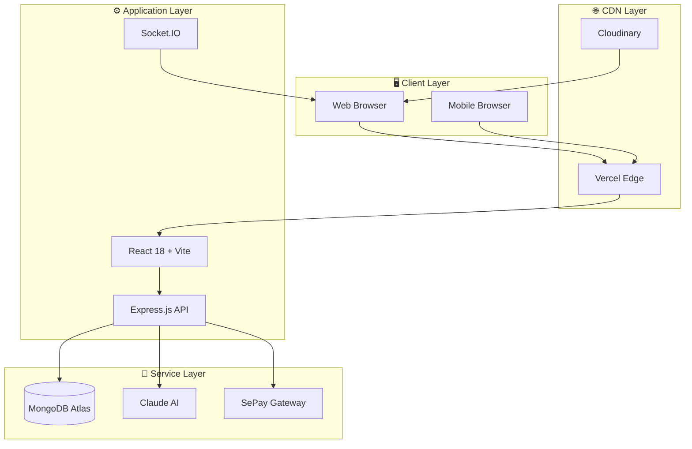
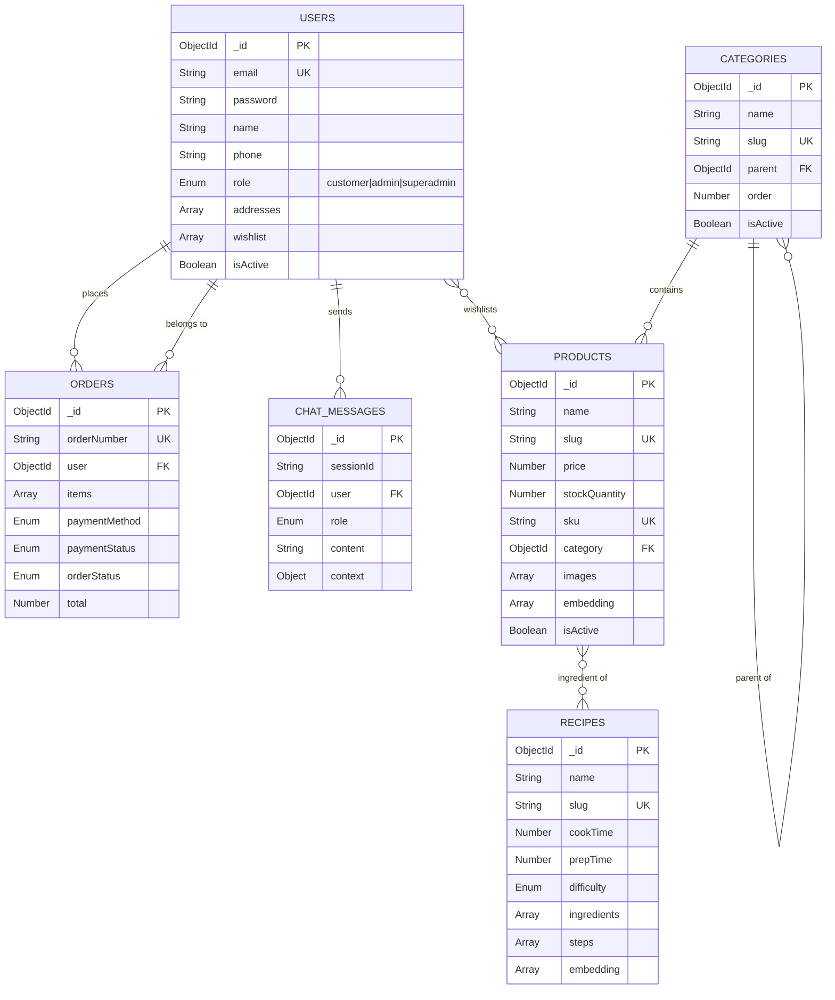
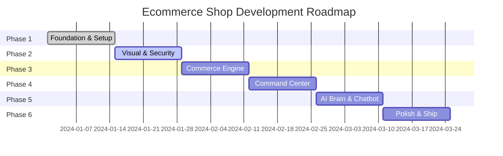

<p align="center">
  
  
  
  
  
</p>

<h1 align="center">
  <br>
  🛒 Ecommerce Shop
  <br>
</h1>

<h4 align="center">AI-Powered Food Shopping Platform with Recipe Intelligence</h4>

<p align="center">
  <a href="#-introduction">Introduction</a> •
  <a href="#-features">Features</a> •
  <a href="#-architecture">Architecture</a> •
  <a href="#-quick-start">Quick Start</a> •
  <a href="#-documentation">Docs</a> •
  <a href="#-roadmap">Roadmap</a>
</p>

---

## 📖 Introduction

**Ecommerce Shop** là nền tảng thương mại điện tử SaaS thế hệ mới, được thiết kế đặc biệt cho ngành thực phẩm với ba điểm khác biệt cốt lõi:

| USP | Mô tả |
|-----|-------|
| 🧠 **AI Recipe Intelligence** | Gợi ý món ăn thông minh dựa trên nguyên liệu có sẵn trong kho |
| 🤖 **Smart Shopping Assistant** | Chatbot AI phân tích ngữ cảnh giỏ hàng và cảm xúc người dùng |
| 💳 **SePay Auto-Payment** | Xác nhận thanh toán realtime qua QR Code và Webhook |

### Tại sao chọn Ecommerce Shop?

- **Trải nghiệm mua sắm thông minh**: AI hiểu bạn muốn nấu gì và gợi ý nguyên liệu phù hợp
- **Tiết kiệm thời gian**: Thêm tất cả nguyên liệu công thức vào giỏ hàng chỉ với một click
- **Thanh toán liền mạch**: Quét QR, chuyển khoản, tự động xác nhận - không cần chờ đợi
- **UI/UX hiện đại**: Glassmorphism design, Dark mode, Micro-interactions

---

## ✨ Features

### 🛍️ Customer Features

```
┌─────────────────────────────────────────────────────────────────┐
│  STOREFRONT           │  RECIPE HUB           │  AI ASSISTANT   │
├─────────────────────────────────────────────────────────────────┤
│  • Product Catalog    │  • Recipe Explorer    │  • Smart Chat   │
│  • Advanced Filters   │  • Ingredient Check   │  • Cart Context │
│  • Quick Add to Cart  │  • One-click Add All  │  • Sentiment    │
│  • Wishlist           │  • Cost Calculator    │  • Suggestions  │
└─────────────────────────────────────────────────────────────────┘
```

### 🔐 Authentication & Security
- JWT-based authentication với refresh tokens
- Role-Based Access Control (RBAC): Customer, Admin, SuperAdmin
- Password hashing với bcrypt
- Rate limiting và security headers (Helmet)

### 💰 Payment Integration
- **COD (Cash on Delivery)**: Đặt hàng ngay, thanh toán khi nhận
- **SePay Gateway**: QR Code → Bank Transfer → Webhook → Auto-confirm

### 📊 Admin Dashboard
- Revenue analytics và reporting
- Inventory management với low-stock alerts
- Order management với realtime status updates
- Recipe-Product mapping tool cho AI training

---

## 🏗️ Architecture

### System Overview



### Tech Stack

| Layer | Technology | Purpose |
|-------|------------|---------|
| **Frontend** | React 18, TypeScript, Vite | UI Framework |
| | Tailwind CSS, Framer Motion | Styling & Animation |
| | Zustand, React Query | State Management |
| | React Router v6 | Routing |
| **Backend** | Node.js, Express | API Server |
| | MongoDB, Mongoose | Database |
| | Socket.IO | Real-time Communication |
| | JWT, bcrypt | Authentication |
| **AI** | LangChain.js | AI Orchestration |
| | Claude 3.5 Sonnet | Language Model |
| | MongoDB Vector Search | Semantic Search |
| **Infrastructure** | Cloudinary | Media CDN |
| | SePay | Payment Gateway |

---

## 📊 Database Design

### Entity Relationship Diagram



---

## 🎯 Use Case Diagram

```mermaid
flowchart TB
    subgraph Actors
        Customer((👤 Customer))
        Admin((👨‍💼 Admin))
        AI((🤖 AI System))
        Payment((💳 SePay))
    end

    subgraph "🔐 Authentication"
        UC1[Register Account]
        UC2[Login / Logout]
        UC3[Manage Profile]
    end

    subgraph "🛒 Shopping"
        UC4[Browse Products]
        UC5[Search & Filter]
        UC6[Add to Cart]
        UC7[Manage Wishlist]
    end

    subgraph "💳 Checkout"
        UC8[Place Order]
        UC9[Pay with COD]
        UC10[Pay with SePay]
        UC11[Track Order]
    end

    subgraph "🍳 Recipe"
        UC12[Browse Recipes]
        UC13[View Recipe Detail]
        UC14[Add Ingredients to Cart]
    end

    subgraph "🤖 AI Assistant"
        UC15[Chat with AI]
        UC16[Get Recommendations]
        UC17[Recipe Suggestions]
    end

    subgraph "📊 Administration"
        UC18[Manage Products]
        UC19[Manage Orders]
        UC20[Manage Recipes]
        UC21[View Analytics]
    end

    Customer --> UC1 & UC2 & UC3
    Customer --> UC4 & UC5 & UC6 & UC7
    Customer --> UC8 & UC11
    Customer --> UC12 & UC13 & UC14
    Customer --> UC15

    Admin --> UC2
    Admin --> UC18 & UC19 & UC20 & UC21

    AI --> UC16 & UC17
    UC15 --> AI

    UC8 --> UC9
    UC8 --> UC10
    UC10 --> Payment
```



---

## 🚀 Quick Start

### Prerequisites

Đảm bảo bạn đã cài đặt:

- **Node.js** >= 18.0.0 ([Download](https://nodejs.org/))
- **npm** >= 9.0.0 hoặc **yarn** >= 1.22.0
- **MongoDB Atlas** account ([Sign up](https://www.mongodb.com/atlas))
- **Git** ([Download](https://git-scm.com/))

### Installation

```bash
# 1. Clone repository
git clone https://github.com/your-username/ecommerce-shop.git
cd ecommerce-shop

# 2. Install dependencies (cả client và server)
npm install

# 3. Setup environment variables
cp server/.env.example server/.env
cp client/.env.example client/.env

# 4. Edit .env files với credentials của bạn
# (Xem phần Environment Configuration bên dưới)

# 5. Seed database (optional - tạo data mẫu)
cd server && npx tsx src/scripts/seedDatabase.ts

# 6. Start development servers
cd .. && npm run dev
```

### Verify Installation

Sau khi chạy `npm run dev`, mở browser:

| Service | URL | Status |
|---------|-----|--------|
| Frontend | http://localhost:5173 | React App |
| Backend API | http://localhost:5000/api | REST API |
| Health Check | http://localhost:5000/health | `{"status": "ok"}` |

---

## ⚙️ Environment Configuration

### Server Environment (`server/.env`)

```bash
# ═══════════════════════════════════════════════════════════════
# SERVER CONFIGURATION
# ═══════════════════════════════════════════════════════════════

# Application
NODE_ENV=development                    # development | production
PORT=5000                               # API server port

# ───────────────────────────────────────────────────────────────
# DATABASE
# ───────────────────────────────────────────────────────────────
MONGODB_URI=mongodb+srv://<user>:<password>@cluster.mongodb.net/ecommerce_shop

# ───────────────────────────────────────────────────────────────
# AUTHENTICATION
# ───────────────────────────────────────────────────────────────
JWT_SECRET=your-super-secret-key-min-32-characters
JWT_EXPIRES_IN=7d                       # Token expiration

# ───────────────────────────────────────────────────────────────
# CLOUDINARY (Media Storage)
# ───────────────────────────────────────────────────────────────
CLOUDINARY_CLOUD_NAME=your-cloud-name
CLOUDINARY_API_KEY=your-api-key
CLOUDINARY_API_SECRET=your-api-secret

# ───────────────────────────────────────────────────────────────
# SEPAY (Payment Gateway)
# ───────────────────────────────────────────────────────────────
SEPAY_API_KEY=your-sepay-api-key
SEPAY_ACCOUNT_NUMBER=your-bank-account
SEPAY_BANK_NAME=your-bank-name
SEPAY_WEBHOOK_SECRET=your-webhook-secret

# ───────────────────────────────────────────────────────────────
# AI (Claude API)
# ───────────────────────────────────────────────────────────────
ANTHROPIC_API_KEY=sk-ant-xxxxx

# ───────────────────────────────────────────────────────────────
# CORS
# ───────────────────────────────────────────────────────────────
CLIENT_URL=http://localhost:5173
```

### Client Environment (`client/.env`)

```bash
# ═══════════════════════════════════════════════════════════════
# CLIENT CONFIGURATION
# ═══════════════════════════════════════════════════════════════

VITE_API_URL=http://localhost:5000/api
VITE_CLOUDINARY_CLOUD_NAME=your-cloud-name
```

---

## 📁 Project Structure

```
ecommerce-shop/
├── 📂 client/                      # Frontend Application
│   ├── 📂 public/                  # Static assets
│   ├── 📂 src/
│   │   ├── 📂 components/          # Shared UI components
│   │   │   ├── 📂 layout/          # Header, Footer, Sidebar
│   │   │   ├── 📂 ui/              # Button, Input, Modal, Card
│   │   │   └── 📂 pages/           # Error pages (404, 500)
│   │   │
│   │   ├── 📂 features/            # Feature-based modules
│   │   │   ├── 📂 shop/            # Product listing, detail
│   │   │   ├── 📂 cart/            # Shopping cart
│   │   │   ├── 📂 checkout/        # Checkout flow
│   │   │   ├── 📂 auth/            # Login, Register
│   │   │   ├── 📂 recipe/          # Recipe hub
│   │   │   ├── 📂 chatbot/         # AI assistant
│   │   │   └── 📂 admin/           # Admin dashboard
│   │   │
│   │   ├── 📂 hooks/               # Custom React hooks
│   │   ├── 📂 lib/                 # Utilities, API client
│   │   ├── 📂 stores/              # Zustand state stores
│   │   ├── 📂 styles/              # Global CSS, Tailwind
│   │   ├── 📂 types/               # TypeScript definitions
│   │   │
│   │   ├── 📄 App.tsx              # Root component + Router
│   │   ├── 📄 main.tsx             # Entry point
│   │   └── 📄 vite-env.d.ts        # Vite types
│   │
│   ├── 📄 index.html
│   ├── 📄 package.json
│   ├── 📄 tailwind.config.ts
│   ├── 📄 tsconfig.json
│   └── 📄 vite.config.ts
│
├── 📂 server/                      # Backend Application
│   ├── 📂 src/
│   │   ├── 📂 config/              # Database, Cloudinary, env
│   │   ├── 📂 controllers/         # Route handlers
│   │   ├── 📂 middlewares/         # Auth, Error handling
│   │   ├── 📂 models/              # Mongoose schemas
│   │   │   ├── 📄 User.model.ts
│   │   │   ├── 📄 Product.model.ts
│   │   │   ├── 📄 Category.model.ts
│   │   │   ├── 📄 Recipe.model.ts
│   │   │   ├── 📄 Order.model.ts
│   │   │   └── 📄 ChatMessage.model.ts
│   │   │
│   │   ├── 📂 routes/              # API route definitions
│   │   ├── 📂 services/            # Business logic, AI
│   │   ├── 📂 scripts/             # DB seeds, migrations
│   │   ├── 📂 utils/               # Helpers, validators
│   │   └── 📄 index.ts             # Express entry point
│   │
│   ├── 📄 package.json
│   └── 📄 tsconfig.json
│
├── 📂 shared/                      # Shared TypeScript types
│   └── 📂 types/
│       └── 📄 index.ts
│
├── 📂 docs/                        # Documentation
│   └── 📄 DIAGRAMS.md              # System diagrams
│
├── 📄 .gitignore
├── 📄 .nvmrc                       # Node version
├── 📄 package.json                 # Monorepo root
└── 📄 README.md                    # This file
```

---

## 🔧 Available Scripts

### Root Level

| Command | Description |
|---------|-------------|
| `npm run dev` | Start cả frontend và backend (concurrent) |
| `npm run dev:client` | Start frontend only (port 5173) |
| `npm run dev:server` | Start backend only (port 5000) |
| `npm run build` | Build cả client và server |
| `npm run lint` | Lint tất cả workspaces |

### Server Scripts

```bash
cd server

npm run dev          # Start với hot-reload (tsx watch)
npm run build        # Compile TypeScript
npm run start        # Run compiled JS (production)
```

### Client Scripts

```bash
cd client

npm run dev          # Start Vite dev server
npm run build        # Build for production
npm run preview      # Preview production build
npm run lint         # ESLint check
```

---

## 🤝 Contributing

Chúng tôi hoan nghênh mọi đóng góp! Hãy làm theo các bước sau:

### Development Workflow

```bash
# 1. Fork repository

# 2. Clone fork của bạn
git clone https://github.com/YOUR_USERNAME/ecommerce-shop.git

# 3. Tạo branch mới
git checkout -b feature/amazing-feature

# 4. Commit changes (Conventional Commits)
git commit -m "feat(scope): add amazing feature"

# 5. Push branch
git push origin feature/amazing-feature

# 6. Mở Pull Request
```

### Commit Convention

Sử dụng [Conventional Commits](https://www.conventionalcommits.org/):

```
<type>(<scope>): <description>

[optional body]

[optional footer]
```

| Type | Description |
|------|-------------|
| `feat` | New feature |
| `fix` | Bug fix |
| `docs` | Documentation only |
| `style` | Code style (formatting, semicolons) |
| `refactor` | Code refactoring |
| `perf` | Performance improvement |
| `test` | Adding tests |
| `chore` | Maintenance tasks |

**Examples:**
```bash
feat(cart): add quantity adjustment buttons
fix(checkout): resolve SePay webhook verification
docs(readme): update installation instructions
refactor(auth): simplify JWT middleware logic
```

### Code Style

- **TypeScript**: Strict mode enabled
- **ESLint**: Airbnb config với custom rules
- **Prettier**: Consistent formatting
- **Naming**: camelCase cho variables, PascalCase cho components

---

## 🗺️ Roadmap

### Development Phases



### Phase Details

| Phase | Name | Status | Key Deliverables |
|-------|------|--------|------------------|
| 1 | **Foundation** | ✅ Done | Monorepo, Schemas, API Routes |
| 2 | **Visual & Security** | 🔄 In Progress | Design System, Auth Flow |
| 3 | **Commerce Engine** | ⏳ Planned | Storefront, Cart, Checkout |
| 4 | **Command Center** | ⏳ Planned | Admin Dashboard, CRUD |
| 5 | **AI Brain** | ⏳ Planned | LangChain, Chatbot, Recipe AI |
| 6 | **Polish & Ship** | ⏳ Planned | Testing, Optimization, Deploy |

### Future Enhancements

- [ ] Mobile app (React Native)
- [ ] Multi-vendor marketplace
- [ ] Subscription boxes
- [ ] Loyalty program
- [ ] Voice-enabled shopping
- [ ] AR ingredient scanner

---

## 📄 License

Distributed under the **MIT License**. See `LICENSE` for more information.

```
MIT License

Copyright (c) 2024 Ecommerce Shop

Permission is hereby granted, free of charge, to any person obtaining a copy
of this software and associated documentation files (the "Software"), to deal
in the Software without restriction, including without limitation the rights
to use, copy, modify, merge, publish, distribute, sublicense, and/or sell
copies of the Software, and to permit persons to whom the Software is
furnished to do so, subject to the following conditions:

The above copyright notice and this permission notice shall be included in all
copies or substantial portions of the Software.
```

---

## 🙏 Acknowledgements

- [React](https://react.dev/) - UI Library
- [Tailwind CSS](https://tailwindcss.com/) - Utility-first CSS
- [MongoDB](https://www.mongodb.com/) - Database
- [Anthropic Claude](https://www.anthropic.com/) - AI Model
- [LangChain](https://langchain.com/) - AI Framework
- [Framer Motion](https://www.framer.com/motion/) - Animations
- [Lucide Icons](https://lucide.dev/) - Icon Library

---

<p align="center">
  Made with ❤️ by the Ecommerce Shop Team
</p>

<p align="center">
  <a href="#-introduction">Back to Top ↑</a>
</p>
