# Ecommerce Shop - System Diagrams

## 1. USE CASE DIAGRAM

```mermaid
flowchart TB
    subgraph Actors
        Customer((Customer))
        Admin((Admin))
        AI((AI System))
        SePay((SePay Gateway))
    end

    subgraph "Authentication System"
        UC1[Register]
        UC2[Login]
        UC3[Logout]
        UC4[Manage Profile]
    end

    subgraph "Shopping System"
        UC5[Browse Products]
        UC6[Search Products]
        UC7[View Product Detail]
        UC8[Add to Cart]
        UC9[Manage Cart]
        UC10[Add to Wishlist]
    end

    subgraph "Checkout System"
        UC11[Checkout]
        UC12[Select Payment Method]
        UC13[Pay with COD]
        UC14[Pay with SePay]
        UC15[View Order History]
        UC16[Track Order]
    end

    subgraph "Recipe System"
        UC17[Browse Recipes]
        UC18[View Recipe Detail]
        UC19[Add Recipe Ingredients to Cart]
        UC20[Get AI Recipe Suggestions]
    end

    subgraph "AI Chatbot System"
        UC21[Chat with AI Assistant]
        UC22[Get Product Recommendations]
        UC23[Analyze Cart Context]
    end

    subgraph "Admin System"
        UC24[Manage Products]
        UC25[Manage Categories]
        UC26[Manage Recipes]
        UC27[Manage Orders]
        UC28[Manage Users]
        UC29[View Dashboard Analytics]
    end

    %% Customer connections
    Customer --> UC1
    Customer --> UC2
    Customer --> UC3
    Customer --> UC4
    Customer --> UC5
    Customer --> UC6
    Customer --> UC7
    Customer --> UC8
    Customer --> UC9
    Customer --> UC10
    Customer --> UC11
    Customer --> UC15
    Customer --> UC16
    Customer --> UC17
    Customer --> UC18
    Customer --> UC19
    Customer --> UC21

    %% Admin connections
    Admin --> UC2
    Admin --> UC24
    Admin --> UC25
    Admin --> UC26
    Admin --> UC27
    Admin --> UC28
    Admin --> UC29

    %% AI connections
    AI --> UC20
    AI --> UC22
    AI --> UC23

    %% SePay connections
    UC14 --> SePay

    %% Include relationships
    UC11 --> UC12
    UC12 --> UC13
    UC12 --> UC14
    UC21 --> UC22
    UC21 --> UC23
```

---

## 2. ACTIVITY DIAGRAM - Checkout Flow

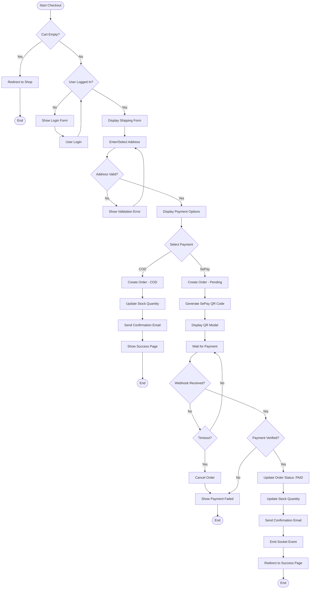

---

## 3. ACTIVITY DIAGRAM - AI Recipe Suggestion

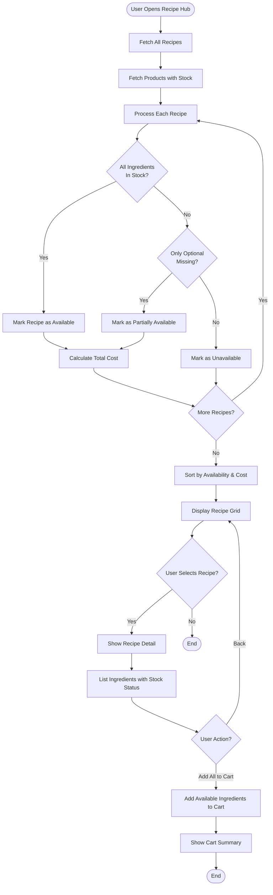

---

## 4. SEQUENCE DIAGRAM - User Authentication

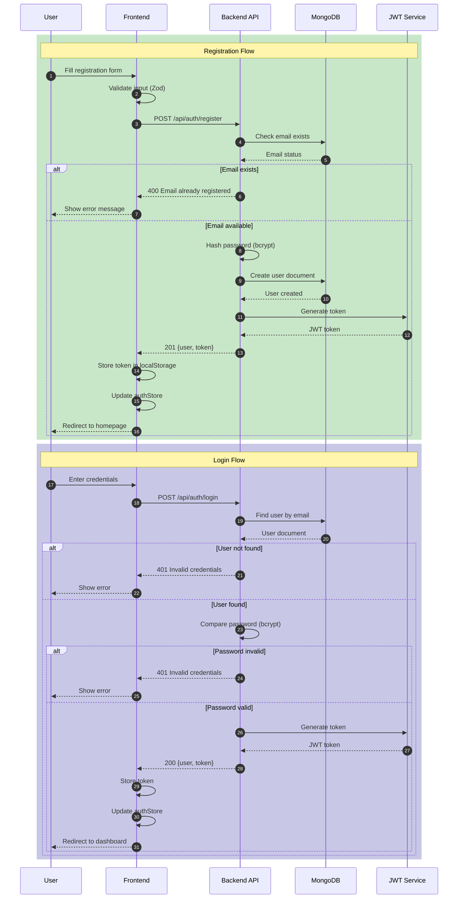

---

## 5. SEQUENCE DIAGRAM - SePay Payment Flow

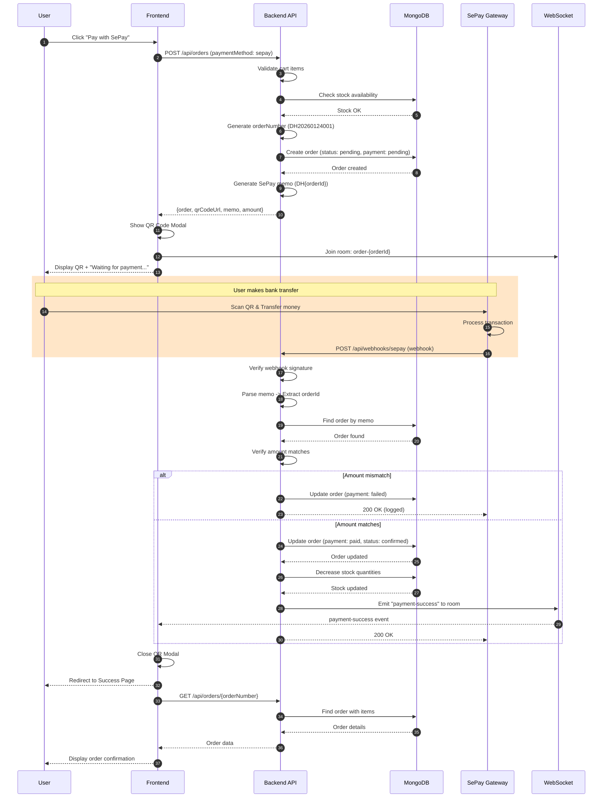

---

## 6. SEQUENCE DIAGRAM - AI Chatbot Interaction

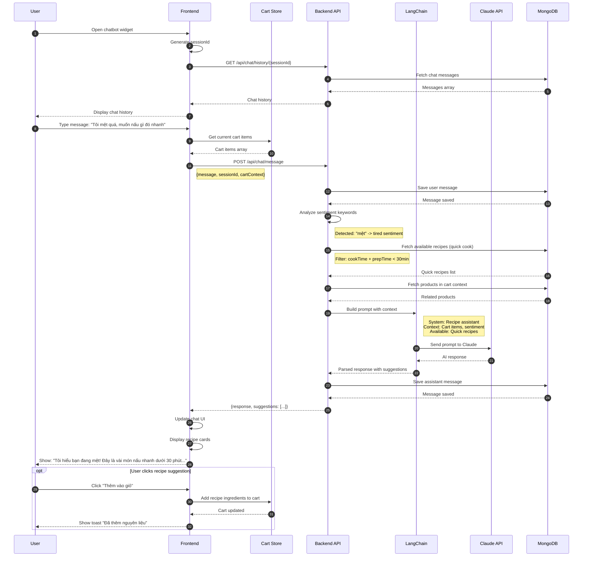

---

## 7. CLASS DIAGRAM

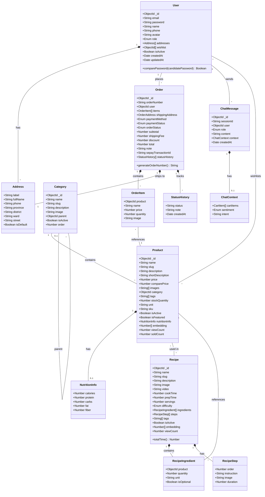

---

## 8. ENTITY RELATIONSHIP DIAGRAM (MongoDB Schema)

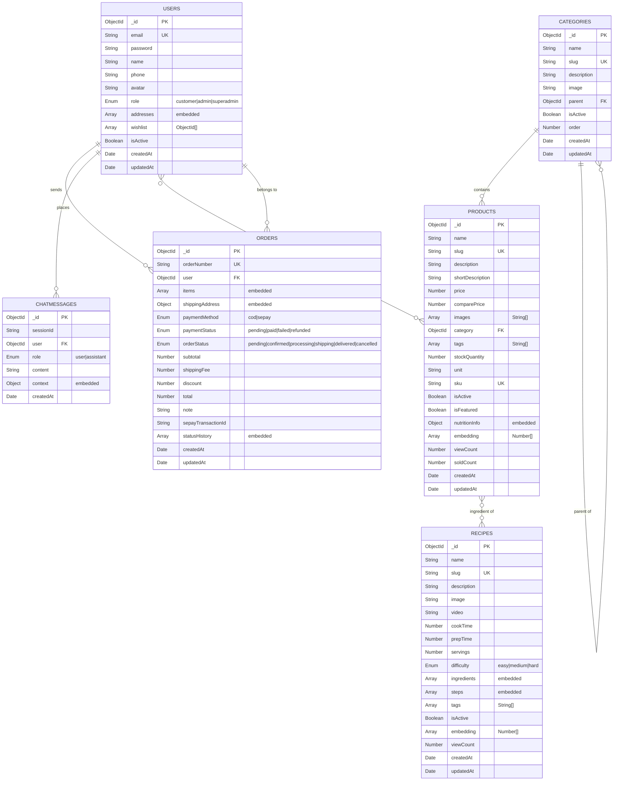

---

## 9. STATE DIAGRAM - Order Status

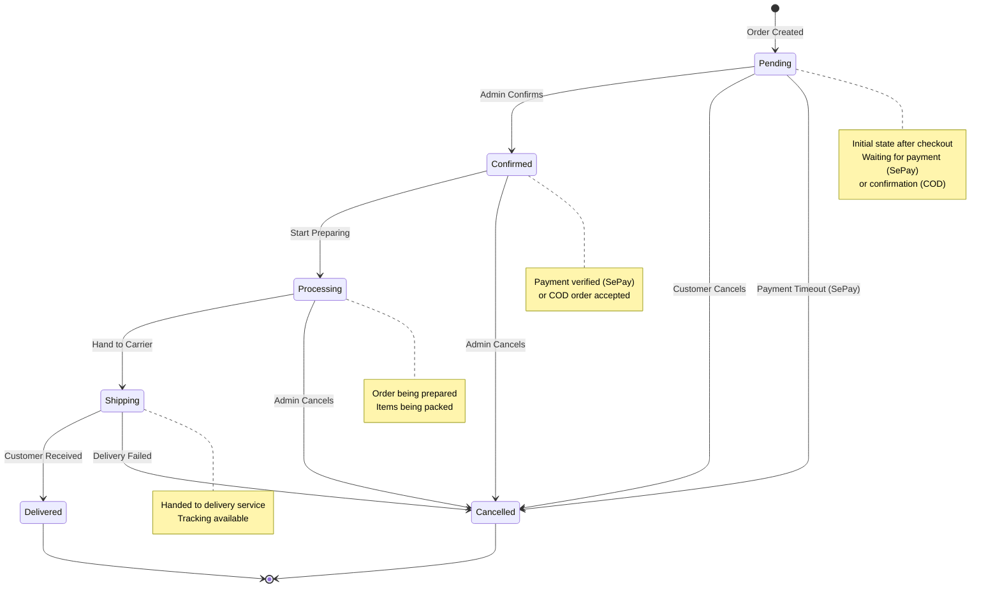

---

## 10. STATE DIAGRAM - Payment Status

```mermaid
stateDiagram-v2
    [*] --> Pending : Order Created

    state COD_Flow {
        Pending --> Paid : Delivered & Cash Collected
    }

    state SePay_Flow {
        Pending --> Paid : Webhook Received & Verified
        Pending --> Failed : Payment Timeout
        Pending --> Failed : Amount Mismatch
    }

    Paid --> Refunded : Admin Processes Refund
    Failed --> Pending : Retry Payment

    Paid --> [*]
    Refunded --> [*]

    note right of Pending
        Waiting for payment
        COD: Until delivery
        SePay: Until webhook
    end note

    note right of Paid
        Payment confirmed
        Stock decremented
        Email sent
    end note

    note right of Failed
        Payment unsuccessful
        Stock restored
        User notified
    end note
```

---

## 11. COMPONENT DIAGRAM - Frontend Architecture

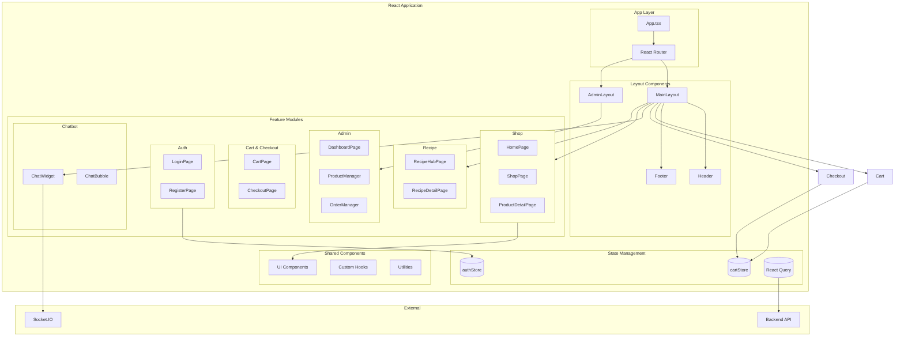

---

## 12. DEPLOYMENT DIAGRAM

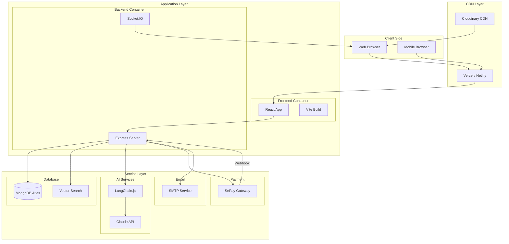

---

## Summary

| Diagram | Purpose |
|---------|---------|
| Use Case | Shows all system actors and their interactions |
| Activity (Checkout) | Detailed checkout flow with COD and SePay |
| Activity (Recipe AI) | AI recipe suggestion logic |
| Sequence (Auth) | Registration and login flow |
| Sequence (SePay) | Real-time payment processing |
| Sequence (Chatbot) | AI chatbot interaction flow |
| Class Diagram | Object-oriented design of entities |
| ERD | MongoDB schema relationships |
| State (Order) | Order status transitions |
| State (Payment) | Payment status transitions |
| Component | Frontend architecture |
| Deployment | System deployment topology |
